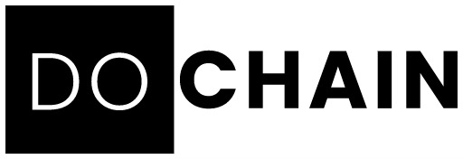

[![MIT License][license-shield]][license-url]
<a name="readme-top"></a>
    
<br />
<div align="center">
    <a href="https://github.com/Alberto-SC/dochain">
        
    </a>
    <h3 align="center"> Dochain repository </h3>
    <p align="center">
        An application to save your documents and share them safely
    <br/>
    <a href="https://github.com/Alberto-SC/dochain"><strong> Explore the docs » </strong></a>
    <a href="https://goerli.etherscan.io/address/0x85506e0eA2864e1BEE87C6eDCa92745a204394e0#code"><strong> Last contract deployed » </strong></a>
    </p>
</div> 

<details>
  <summary>Table of Contents</summary>
  <ol>
    <li>
      <a href="#sobre-el-proyecto">About the project</a>
      <ul>
        <li><a href="#construido-con">Built with</a></li>
      </ul>
    </li>
    <li>
      <a href="#empezando">Getting Started</a>
      <ul>
        <li><a href="#prerequisitos">Prerequisites</a></li>
        <li><a href="#instalacion">Installation</a></li>
      </ul>
    </li>
    <li><a href="#usage">Usage</a></li>
    <li><a href="#roadmap">Roadmap</a></li>
    <li><a href="#licencia">License</a></li>
    <li><a href="#autores">Contact</a></li>
  </ol>
</details>


## About the project 

This project consists of storing all kinds of files, images, documents, pdf's, etc, that may contain sensitive information or just that you need to stay private and persistent., the app allow you to create shareable directories and upload files with the freedom to decide who can see that document. directories/files are represented by an ERC1155 token and will be encrypted to ensure privacy.

<p align="right">(<a href="#readme-top">back to top</a>)</p>


### Built with

To represent directories/files we will use the ERC 1155 standard so that several people can own a directory.
For the storage of the files we will not store them in the blockchain, but we use IPFS to store any and then only have to store a URL.
To retrieve data on the front-end, we will develop a subgraph that allows us to be more efficient in queries like, 'How many directories/files does a certain person have access to', 'Who are the people who have access to a certain directory/file'
For encryption, we will use a metamask compatible cipher in case we cannot work out a more secure private key escrow method.

* 
* 
* 
* 
* 
* 

<p align="right">(<a href="#readme-top">back to top</a>)</p>

## Getting Started
### Prerequisites

* Git
    Sabrá que lo hizo bien si puede ejecutar `git --version` y ve una respuesta como `git version x.x.x`
* Nodejs
    Sabrá que ha instalado nodejs correctamente si puede ejecutar:
    `node --version` y obtenga una salida como: `vx.x.x`
* yarn 
    Sabrá que ha instalado yarn correctamente si puede ejecutar:
    `yarn --version` y obtener una salida como: `x.x.x`

### Installation

1. Clona el repositorio
   ```sh
   git clone https://github.com/Alberto-SC/dochain
   ```
2. Instala las dependencias
   ```sh
   yarn
   ```
3. Crea un archivo `.env`  e introduce tus llaves, tienes el archvio `.env.example` como modelo, ejemplo: 
   ```js
   const API_KEY = 'ENTER YOUR API';
   ```

<p align="right">(<a href="#readme-top">back to top</a>)</p>

## Usage

Deploy:
```sh
    yarn deploy
```
Testing:
```sh
    yarn test
```
Test Coverage:
```sh
    yarn coverage
```

<p align="right">(<a href="#readme-top">back to top</a>)</p>


<!-- LICENSE -->
## License

Distributed under the MIT license. See `LICENSE.txt` for more information.

<p align="right">(<a href="#readme-top">back to top</a>)</p>

## Contact

👤 **Alberto Silva Cazares**

- GitHub: [@Alberto-SC](https://github.com/Alberto-SC)

👤 **José Piña**

- GitHub: [@pinajmr](https://github.com/pinajmr)
- Twitter: [@pinajmr]( https://twitter.com/pinajmr)
- LinkedIn: [José Piña](https://www.linkedin.com/in/pinajmr/)


<p align="right">(<a href="#readme-top">back to top</a>)</p>

[license-shield]: https://img.shields.io/github/license/othneildrew/Best-README-Template.svg?style=for-the-badge
[license-url]: https://github.com/othneildrew/Best-README-Template/blob/master/LICENSE.txt

